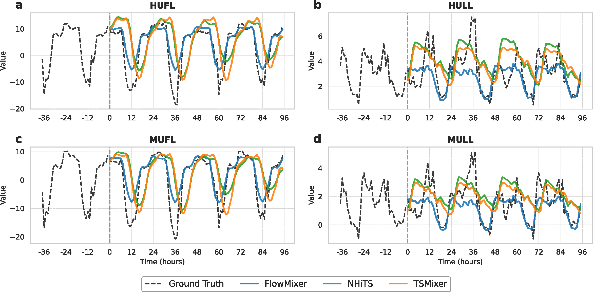
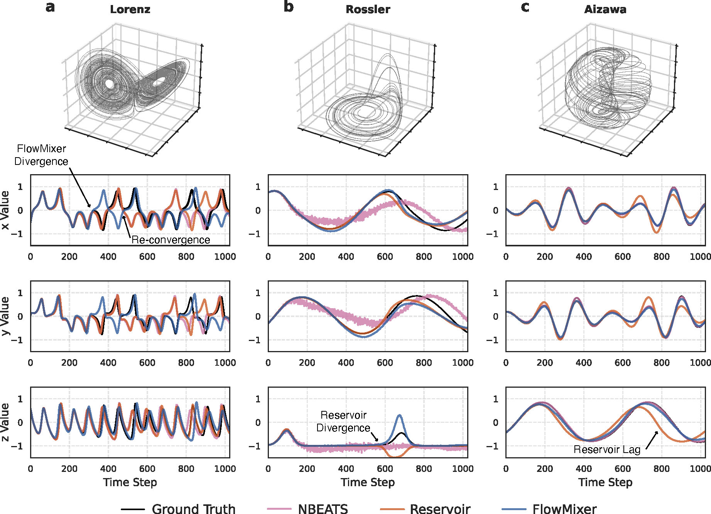
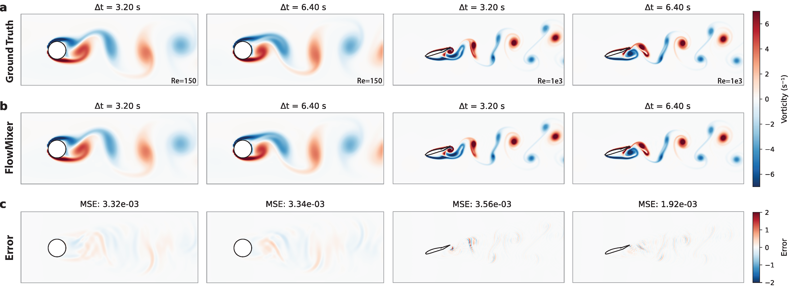
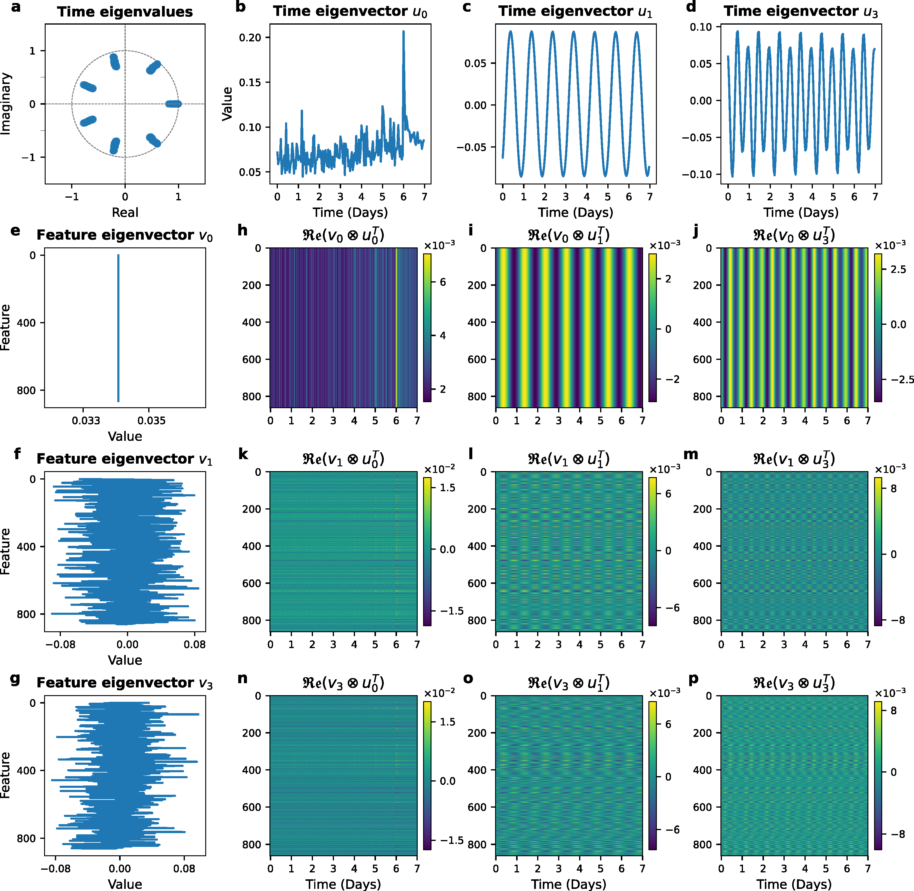

# 🌊 FlowMixer: Depth-Agnostic Neural Architecture for Interpretable Spatiotemporal Forecasting

[](https://neurips.cc/)
[](https://arxiv.org/abs/2025.16786)
[](https://opensource.org/licenses/MIT)
[](https://www.python.org/downloads/)
[](https://pytorch.org/)
[](https://tensorflow.org/)

**[Paper](link) | [Slides](link) | [Poster](link) | [arXiv](https://arxiv.org/abs/2025.16786)**

## 🎯 TL;DR

**FlowMixer** introduces a mathematically constrained neural architecture where **a single operational layer can represent any depth** through semi-group composition. This eliminates neural depth search while achieving strong performance on time series forecasting, chaos prediction, and turbulent flow modeling.

<p align="center">
  
  <br>
  <em>FlowMixer architecture: Reversible normalization (φ) wraps constrained mixing operations (W_t, W_f) to create interpretable spatiotemporal patterns</em>
</p>

## ✨ Why FlowMixer?

- **🏗️ Depth-Agnostic**: Single layer with semi-group property - no depth tuning needed
- **🔬 Interpretable**: Direct extraction of Kronecker-Koopman spatiotemporal eigenmodes  
- **📈 Performance**: Outperforms many 2023 and 2024 models
- **⚡ Efficient**: 16× faster than spectral methods for fluid dynamics
- **🎯 Versatile**: Unified framework for statistics and dynamics

## 🚀 Quick Start

All notebooks include the complete FlowMixer implementation inline, demonstrating the architecture's simplicity - no complex dependencies or deep frameworks needed!

## 📚 Interactive Notebooks

Explore FlowMixer through hands-on Jupyter notebooks:

| Notebook | Framework | Key Features | Runtime |
|----------|-----------|--------------|---------|
| [**1. Interactive Demo**](notebooks/1_FlowMixer_Interactive_Pytorch.ipynb) | PyTorch | • Interactive widgets for real-time experimentation<br>• Kronecker-Koopman eigenmode visualization<br>• Multiple mixer types (standard, exp, periodic) | 5-10 min |
| [**2. Time Series**](notebooks/2_FlowMixer_Time_Series_Forecasting.ipynb) | TensorFlow | • Benchmark datasets (ETT, Weather, Traffic)<br>• RevIN & TD-RevIN normalization<br>• Reproduces paper Table 1 results | 2-120 s/epoch |
| [**3. Chaos Prediction**](notebooks/3_Chaotic_Attractors_Prediction.ipynb) | TensorFlow | • Lorenz, Rössler, Aizawa attractors<br>• SOBR implementation<br>• 1024-step long-term predictions | ~10 min |
| [**4. Fluid Dynamics**](notebooks/4_CylinderFlow_Prediction.ipynb) | TF + CuPy | • GPU-accelerated Navier-Stokes<br>• Cylinder & airfoil flows<br>• 16× faster than spectral methods | ~45 min |

### Running the Notebooks

#### Option 1: Google Colab (Recommended for quick start)
Each notebook can be run directly in Google Colab - just click the Colab badge at the top of each notebook.

#### Option 2: Local Setup

```bash
# Install base requirements
pip install jupyter numpy pandas matplotlib tensorflow torch

# For notebook 4 (fluid dynamics) - requires CUDA GPU
pip install cupy-cuda11x  # Adjust for your CUDA version
```

### Launch
```bash
# Launch interactive demo
jupyter notebook notebooks/1_FlowMixer_Interactive_Pytorch.ipynb
```

All notebooks are self-contained with documentation and can run independently. Start with notebook 1 for an interactive introduction, or jump directly to your domain of interest.

## 🔬 Key Results

### Long Horizon Time-Series Forecasting
<p align="center">
  
  <br>
  <em>Example of forecasting curves on the ETTh1 dataset</em>
</p>

### Chaotic Systems
<p align="center">
  
  <br>
  <em>Long-term predictions (1024 steps) for Lorenz, Rössler, and Aizawa attractors</em>
</p>

### Turbulent Flows
<p align="center">
  
  <br>
  <em>Cylinder flow (Re=150) and NACA airfoil (Re=1000)</em>
</p>

### Kronecker-Koopman Eigenmodes
<p align="center">
  
  <br>
  <em>Direct extraction of interpretable spatiotemporal patterns from traffic data</em>
</p>

## 📊 Expected Outputs

Each notebook generates specific visualizations and metrics:

| Notebook | Key Outputs |
|----------|-------------|
| 1 | Eigenmode decomposition plots, training curves, interactive predictions |
| 2 | Performance tables (MSE/MAE), comparison with baselines |
| 3 | Attractor trajectories, phase space plots, long-term predictions |
| 4 | Vorticity fields, flow visualizations, error maps |


## 🔧 Data Preparation

### Required Datasets
Place these files in `data/` directory:

| Dataset | Files | Source & Credit |
|---------|-------|-----------------|
| **ETT** | ETT{h1,h2,m1,m2}.csv | [Zhou et al., 2021](https://github.com/zhouhaoyi/ETDataset) |
| **Weather** | Weather.csv | [Max Planck Institute Biogeochemistry](https://www.bgc-jena.mpg.de/wetter/) |
| **Traffic** | Traffic.csv | [California DOT](http://pems.dot.ca.gov/) |
| **Electricity** | ECL.csv | [UCI ML Repository](https://archive.ics.uci.edu/ml/datasets/ElectricityLoadDiagrams20112014) |

```bash
# Quick setup
mkdir -p data/
cd data/

# Download ETT datasets
wget https://github.com/zhouhaoyi/ETDataset/raw/main/ETT-small/ETTh1.csv
wget https://github.com/zhouhaoyi/ETDataset/raw/main/ETT-small/ETTh2.csv
wget https://github.com/zhouhaoyi/ETDataset/raw/main/ETT-small/ETTm1.csv
wget https://github.com/zhouhaoyi/ETDataset/raw/main/ETT-small/ETTm2.csv

# For other datasets, download from sources above
cd ..
```

### Auto-Generated Data
- **Chaotic Systems** (Notebook 3): Generated via RK4 integration
- **Turbulent Flows** (Notebook 4): Simulated using GPU-accelerated Navier-Stokes

All datasets are used in accordance with their respective licenses for research purposes.

## 💡 Tips

- **Memory Management**: For large datasets (Electricity/Traffic), reduce batch size if needed
- **GPU Usage**: Notebooks 3 and 4 benefit significantly from GPU acceleration
- **Reproducibility**: Random seeds are set for consistent results
- **Customization**: All hyperparameters are clearly marked and can be modified

## 📈 Key Insights Demonstrated

1. **No Depth Search**: Single layer achieves competitive performance - demonstrated across all notebooks
2. **Interpretability**: Direct eigenmode extraction in Notebook 1
3. **Versatility**: Same architecture for time series, chaos, and fluids
4. **Efficiency**: Fast training and inference times documented

## 🐛 Troubleshooting

| Issue | Solution |
|-------|----------|
| CUDA out of memory | Reduce `batch_size` or `seq_len` |
| Dataset not found | Ensure CSV files are in `./data/` folder |
| CuPy import error | Install matching CUDA version or skip Notebook 4 |
| Widget display issues | Enable notebook extensions: `jupyter nbextension enable --py widgetsnbextension` |

## 📝 Notes

- Each notebook contains the **complete FlowMixer implementation** - no external module imports needed
- Code is intentionally kept in notebooks to showcase architectural simplicity
- All experiments use the same core FlowMixer layer, just with different configurations
- Results match or exceed those reported in the NeurIPS paper

## 📖 Citation

If you use these notebooks, please cite:

```bibtex
@inproceedings{mehouachi2025flowmixer,
  title={FlowMixer: A Depth-Agnostic Neural Architecture for 
         Interpretable Spatiotemporal Forecasting},
  author={Mehouachi, Fares B. and Jabari, Saif Eddin},
  booktitle={Advances in Neural Information Processing Systems},
  year={2025}
}
```

## 🤝 Authors

- **Fares B. Mehouachi** - NYU Abu Dhabi ([fares.mehouachi@nyu.edu](mailto:fares.mehouachi@nyu.edu))
- **Saif Eddin Jabari** - NYU Tandon School of Engineering ([sej7@nyu.edu](mailto:sej7@nyu.edu))

## 📄 License

This project is licensed under the MIT License - see the [LICENSE](LICENSE) file for details.

## 🙏 Acknowledgments

This work was supported by the NYUAD Center for Interacting Urban Networks (CITIES), funded by Tamkeen under the NYUAD Research Institute Award CG001.

---

<p align="center">
<b>Found this useful? Please ⭐ star us on GitHub!</b>
</p>
