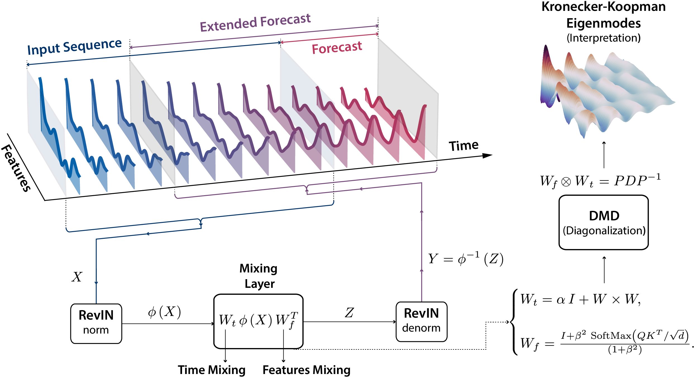

# 🌊 FlowMixer: Depth-Agnostic Neural Architecture for Interpretable Spatiotemporal Forecasting

[](https://neurips.cc/)
[](https://arxiv.org/abs/xxxx)
[](https://opensource.org/licenses/MIT)
[](https://www.python.org/downloads/)
[](https://pytorch.org/)
[](https://tensorflow.org/)

**[Paper](link) | [Project Page](link) | [Video](link) | [Slides](link) | [Poster](link)**

## 🎯 TL;DR

**FlowMixer** introduces a mathematically constrained neural architecture where **a single operational layer can represent any depth** through semi-group composition. This eliminates neural depth search while achieving strong perfomance on time series forecasting, chaos prediction, and turbulent flow modeling.


<p align="center">
  
  <br>
  <em>FlowMixer architecture: Reversible normalization (φ) wraps constrained mixing operations (W_t, W_f) to create interpretable spatiotemporal patterns</em>
</p>


## ✨ Key Features

- **🏗️ Depth-Agnostic**: Single layer with semi-group property - no depth tuning needed
- **🔬 Interpretable**: Direct extraction of Kronecker-Koopman spatiotemporal eigenmodes  
- **📈 Performance**: Outperforms many 2023 and 2024 models
- **⚡ Efficient**: 16× faster than spectral methods for fluid dynamics
- **🎯 Versatile**: Unified framework for statistics and dynamics


# 📓 FlowMixer Notebooks

This directory contains interactive Jupyter notebooks demonstrating FlowMixer's capabilities across different domains. Each notebook is self-contained and can be run independently.

## 🎯 Quick Start

All notebooks include the complete FlowMixer implementation inline, demonstrating the architecture's simplicity - no complex dependencies or deep frameworks needed!

## 📚 Available Notebooks

### 1️⃣ **Interactive PyTorch Demo** [`1_FlowMixer_Interactive_Pytorch.ipynb`](1_FlowMixer_Interactive_Pytorch.ipynb)
- **Framework**: PyTorch
- **Features**: Interactive configuration with widgets
- **Highlights**:
  - Multiple mixer types (standard, exponential, periodic)
  - Real-time Kronecker-Koopman eigenmode analysis
  - EMA and Mixup augmentation options
  - Comprehensive visualization of eigenmodes
- **Runtime**: ~5-10 minutes per experiment
- **Best for**: Understanding the architecture and interpretability

### 2️⃣ **Time Series Forecasting** [`2_FlowMixer_Time_Series_Forecasting.ipynb`](2_FlowMixer_Time_Series_Forecasting.ipynb)
- **Framework**: TensorFlow
- **Features**: Comprehensive benchmarking
- **Highlights**:
  - ETT, Weather, Electricity, Traffic datasets
  - RevIN and TD-RevIN normalization
  - Automated results collection and formatting
  - Reproduces paper Table 1
- **Runtime**: 2-120 seconds/epoch depending on dataset
- **Best for**: Reproducing forecasting results

### 3️⃣ **Chaotic Systems Prediction** [`3_Chaotic_Attractors_Prediction.ipynb`](3_Chaotic_Attractors_Prediction.ipynb)
- **Framework**: TensorFlow with SOBR
- **Features**: Chaos prediction with reservoir computing
- **Highlights**:
  - Lorenz, Rössler, and Aizawa attractors
  - SOBR (Semi-Orthogonal Basic Reservoir) implementation
  - Comparison with Reservoir Computing and N-BEATS
  - Long-term prediction (1024 steps)
- **Runtime**: ~10 minutes per attractor
- **Best for**: Understanding dynamics modeling

### 4️⃣ **2D Turbulent Flow Prediction** [`4_CylinderFlow_Prediction.ipynb`](4_CylinderFlow_Prediction.ipynb)
- **Framework**: TensorFlow + CuPy
- **Features**: GPU-accelerated fluid dynamics
- **Highlights**:
  - Real-time Navier-Stokes simulation
  - Flow past cylinder (Re=150) and NACA airfoil (Re=1000)
  - Vorticity field prediction and visualization
  - 16× faster than spectral methods
- **Runtime**: ~30 min simulation + 15 min training
- **Best for**: Scientific computing applications

## 🚀 Running the Notebooks

### Option 1: Google Colab (Recommended for quick start)
Each notebook can be run directly in Google Colab - just click the Colab badge at the top of each notebook.

### Option 2: Local Setup

```bash
# Install base requirements
pip install jupyter numpy pandas matplotlib tensorflow torch

# For notebook 4 (fluid dynamics) - requires CUDA GPU
pip install cupy-cuda11x  # Adjust for your CUDA version
```

### Option 3: Docker Environment

```bash
# Pull pre-configured environment (coming soon)
docker pull flowmixer/notebooks
docker run -p 8888:8888 flowmixer/notebooks
```

## 📊 Expected Outputs

Each notebook generates specific visualizations and metrics:

| Notebook | Key Outputs |
|----------|-------------|
| 1 | Eigenmode decomposition plots, training curves, interactive predictions |
| 2 | Performance tables (MSE/MAE), comparison with baselines |
| 3 | Attractor trajectories, phase space plots, long-term predictions |
| 4 | Vorticity fields, flow visualizations, error maps |

## 💡 Tips

- **Memory Management**: For large datasets (Electricity/Traffic), reduce batch size if needed
- **GPU Usage**: Notebooks 3 and 4 benefit significantly from GPU acceleration
- **Reproducibility**: Random seeds are set for consistent results
- **Customization**: All hyperparameters are clearly marked and can be modified

## 📈 Key Insights Demonstrated

1. **No Depth Search**: Single layer achieves SOTA - demonstrated across all notebooks
2. **Interpretability**: Direct eigenmode extraction in Notebook 1
3. **Versatility**: Same architecture for time series, chaos, and fluids
4. **Efficiency**: Fast training and inference times documented

## 🐛 Troubleshooting

| Issue | Solution |
|-------|----------|
| CUDA out of memory | Reduce `batch_size` or `seq_len` |
| Dataset not found | Ensure CSV files are in `./data/` folder |
| CuPy import error | Install matching CUDA version or skip Notebook 4 |
| Widget display issues | Enable notebook extensions: `jupyter nbextension enable --py widgetsnbextension` |

## 📝 Notes

- Each notebook contains the **complete FlowMixer implementation** - no external module imports needed
- Code is intentionally kept in notebooks to showcase architectural simplicity
- All experiments use the same core FlowMixer layer, just with different configurations
- Results match or exceed those reported in the NeurIPS paper

## 📖 Citation

If you use these notebooks, please cite:

```bibtex
@inproceedings{mehouachi2025flowmixer,
  title={FlowMixer: A Depth-Agnostic Neural Architecture for 
         Interpretable Spatiotemporal Forecasting},
  author={Mehouachi, Fares B. and Jabari, Saif Eddin},
  booktitle={Advances in Neural Information Processing Systems},
  year={2025}
}
```

